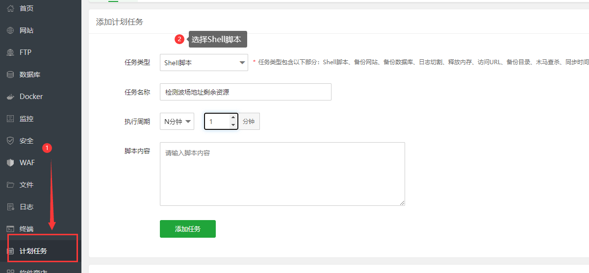

# 检测地址剩余资源

> 使用计划任务定时执行

## 使用宝塔的定时任务运行

选择`Shell`脚本，执行周期可以自己选择



脚本内容如下

```shell
cd /root/check-tron-address-resource
/usr/bin/python3 /root/check-tron-address-resource/main.py
```

`/root/check-tron-address-resource` 更换为你自己存放文件的目录路径

```shell
pip3 install requests -i http://mirrors.aliyun.com/pypi/simple --trusted-host mirrors.aliyun.com
```

## 其他定时任务

- 待完善

## `check_address.json` 配置说明

> 使用JSON数组格式

|字段名|说明|其他备注|
|:----|:----|:----|
|action|触发后动作 字符串列表|目前只支持: `发送提示` `自动充值`|

#### 示例

```json5
[
  {
    // 监听地址
    "address": "TTxxxxxxxxxxxxxxxxxxxxxx",
    // 触发后执行的操作列表
    "action": [
      "发送提示",
      "自动充值"
    ],
    "check": {
      // 能量低于这个值就触发action
      "energy": 65000,
      // 带宽低于这个值就触发action
      "bandwidth": 500,
    },
    "recharge": {
      // 充值能量数量
      "energy": 65000,
      // 充值带宽数量
      "bandwidth": 500
    }
  }
]
```

### 自动充值

前往机器人 https://t.me/TronResBot 获取接口API KEY，充值后直接调用即可